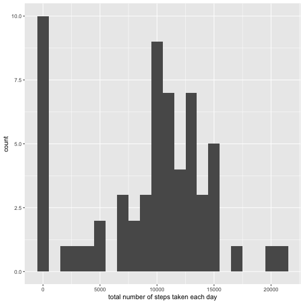
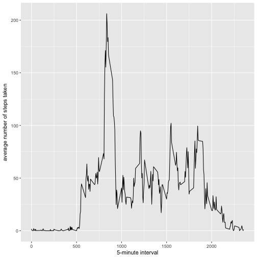
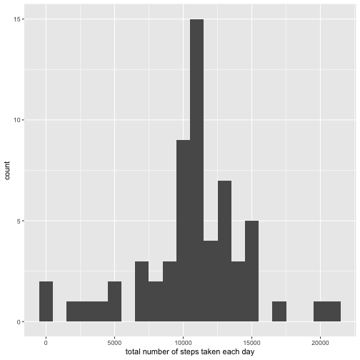
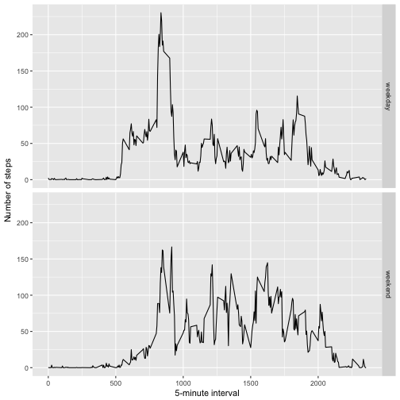

## Introduction
This assignment makes use of data from a personal activity monitoring device. This device collects data at 5 minute intervals through out the day. The data consists of two months of data from an anonymous individual collected during the months of October and November, 2012 and include the number of steps taken in 5 minute intervals each day.


####Download data from website, saved into the default work directory and read csv file into R


```r
download.file("https://d396qusza40orc.cloudfront.net/repdata%2Fdata%2Factivity.zip", 
              "activity.zip")
unzip(zipfile="activity.zip")
data <- read.csv("activity.csv")
```

## What is mean total number of steps taken per day?

For this part of the assignment, we'll ignore the missing values in the dataset.

####Calculate the total number of steps taken per day
Make a histogram of the total number of steps taken each day


```r
library(ggplot2)
total.steps <- tapply(data$steps, data$date, FUN=sum, na.rm=TRUE)
qplot(total.steps, binwidth=1000, 
      xlab="total number of steps taken each day")
```



####Calculate and report the mean and median of the total number of steps taken per day


```r
mean(total.steps, na.rm=TRUE)
```

```
## [1] 9354.23
```

```r
median(total.steps, na.rm=TRUE)
```

```
## [1] 10395
```

## What is the average daily activity pattern?

Make a time series plot (i.e. 𝚝𝚢𝚙𝚎 = "𝚕") of the 5-minute interval (x-axis) and the average number of steps taken, averaged across all days (y-axis)


```r
averages <- aggregate(x=list(steps=data$steps), by=list(interval=data$interval),
                      FUN=mean, na.rm=TRUE)
ggplot(data=averages, aes(x=interval, y=steps)) +
  geom_line() +
  xlab("5-minute interval") +
  ylab("average number of steps taken")
```



##Which 5-minute interval, on average across all the days in the dataset, contains the maximum number of steps?


```r
averages[which.max(averages$steps),]
```

```
##     interval    steps
## 104      835 206.1698
```

##Imputing missing values

Note that there are a number of days/intervals where there are missing values (coded as 𝙽𝙰). The presence of missing days may introduce bias into some calculations or summaries of the data.

####Calculate and report the total number of missing values in the dataset (i.e. the total number of rows with 𝙽𝙰s)


```r
missing <- is.na(data$steps)

table(missing)
```

```
## missing
## FALSE  TRUE 
## 15264  2304
```

####Create a new dataset that is equal to the original dataset but with the missing data filled in with mean value for that 5-minute interval.


```r
fill.value <- function(steps, interval) {
  filled <- NA
  if (!is.na(steps))
    filled <- c(steps)
  else
    filled <- (averages[averages$interval==interval, "steps"])
  return(filled)
}
filled.data <- data
filled.data$steps <- mapply(fill.value, filled.data$steps, filled.data$interval)
```

####Make a histogram of the total number of steps taken each day 


```r
total.steps <- tapply(filled.data$steps, filled.data$date, FUN=sum)
qplot(total.steps, binwidth=1000, xlab="total number of steps taken each day")
```



####Calculate and report the mean and median total number of steps taken per day:

```r
mean(total.steps)
```

```
## [1] 10766.19
```

```r
median(total.steps)
```

```
## [1] 10766.19
```

####Do these values differ from the estimates from the first part of the assignment? 
Yes.

####What is the impact of imputing missing data on the estimates of the total daily number of steps?
Both mean and median values of total steps are higher than original data due to filled value for those missing data (NAs). 


##Are there differences in activity patterns between weekdays and weekends?

Yes. Please see figure below.

####Find the day of the week for each measurement in the dataset with the filled-in values.


```r
weekday.or.weekend <- function(date) {
  day <- weekdays(date)
  if (day %in% c("Monday", "Tuesday", "Wednesday", "Thursday", "Friday"))
    return("weekday")
  else if (day %in% c("Saturday", "Sunday"))
    return("weekend")
  else
    stop("invalid date")
}
filled.data$date <- as.Date(filled.data$date)
filled.data$day <- sapply(filled.data$date, FUN=weekday.or.weekend)
```

####Create a panel plot containing plots of average number of steps taken on weekdays and weekends.


```r
averages <- aggregate(steps ~ interval + day, data=filled.data, mean)
ggplot(averages, aes(interval, steps)) + geom_line() + facet_grid(day ~ .) +
  xlab("5-minute interval") + ylab("Number of steps")
```




